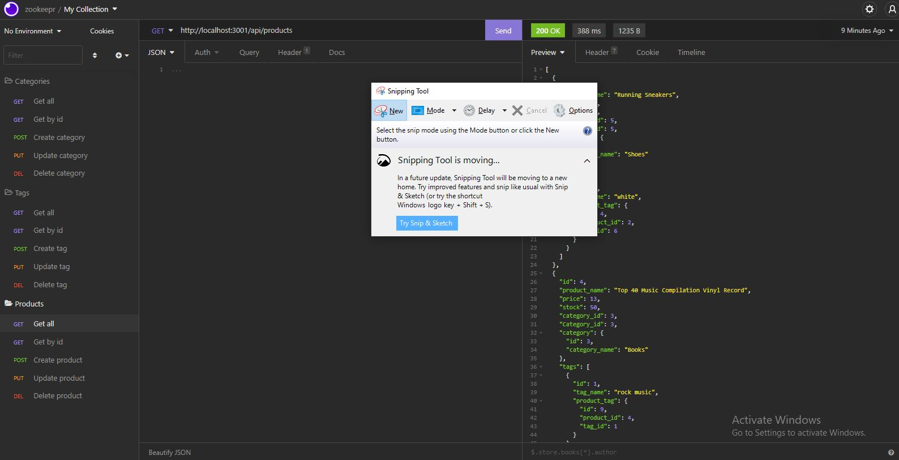

# E-commerce Back End

## Description
    This back end allows for API fetch requests for an e-commerce website. All CRUD methods are represented in this application.

  ## Table of Contents
  *[Installation](#installation)

  *[Usage](#usage)

  *[Links](#links)

  ## Installation
    This application requires node.js, express.js, insomnia, and mysql to run.

  ## Usage
  Run npm install then npm run start and the server will begin. Now fetch requests can be made. make a get requests for everything or add an id to the end of the url to recieve a specific datum. Post requests create new data, put requests can edit data, and delete requests can destroy them.
  

  ## Links

  [GitHub](https://github.com/Dustin2400/E-commerce-back-end)

  [Video Part 1](https://watch.screencastify.com/v/1LIRvtQ5qD1eQzcEQPq1)

  [Video Part 2](https://watch.screencastify.com/v/j0Lodch43poRVsq7KOLZ)

##
  Made with ❤️ by Dustin Grijalva